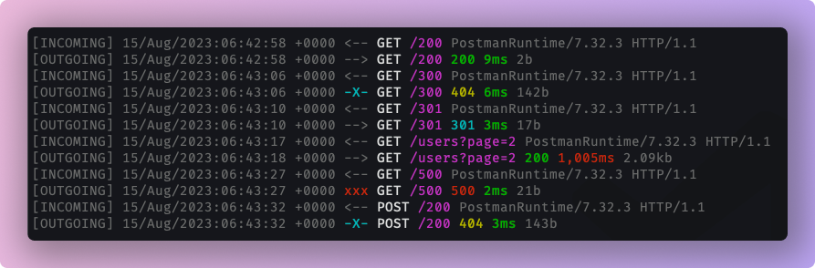

# chrona

Simple HTTP request logger middleware for express.js inspired by [koa-logger](https://github.com/koajs/logger), written in typescript.



## Installation

This is a [Node.js](https://nodejs.org/en/) module available through the [npm registry](https://www.npmjs.com/). Installation is done using the
[`npm install` command](https://docs.npmjs.com/getting-started/installing-npm-packages-locally):

```sh
$ npm install chrona
```

## API

```js
var chrona = require('chrona')

app.use(chrona())
```
> Make sure to add chrona to first in middleware chain.

### chrona(format, options)
Create a new chrona middleware function using the given `format` and `options`. By default, it creates with default `format` and default `options` value.
The `format` argument is a string of predefined token names(see below for token names).

#### Predefined token names.
- :incoming
- :[incoming]
- :remote-address
- :[remote-address]
- :date
- :[date]
- :method
- :[method]
- :url
- :[url]
- :http-version
- :[http-version]
- :status
- :[status]
- :content-length
- :[content-length]
- :response-time
- :[response-time]
- :referrer
- :[referrer]
- :user-agent
- :[user-agent]
> :incoming is special one, If format string contains it, it add directional arrows(`-->`) for incoming request and outgoing response in log string.

### Using a predefined format string

```js
app.use(chrona(":incoming :method :url :status :response-time :content-length :user-agent :http-version"))
```

### options
chroma accepts options argument as a function or an object. Right now chroma has only one option call transporter which can be provided
either by passing function or an object with transporter key. Transporter is for change chrona's default transporter(where to show log messages)
which is `console.log`.

### Use Custom Transporter
```js
// If you want to go with default format string, then just pass
// empty string or null
app.use(chrona(null, function(str, args) => {
    // pass str and args to your own transporter like winston etc.
}))
```
